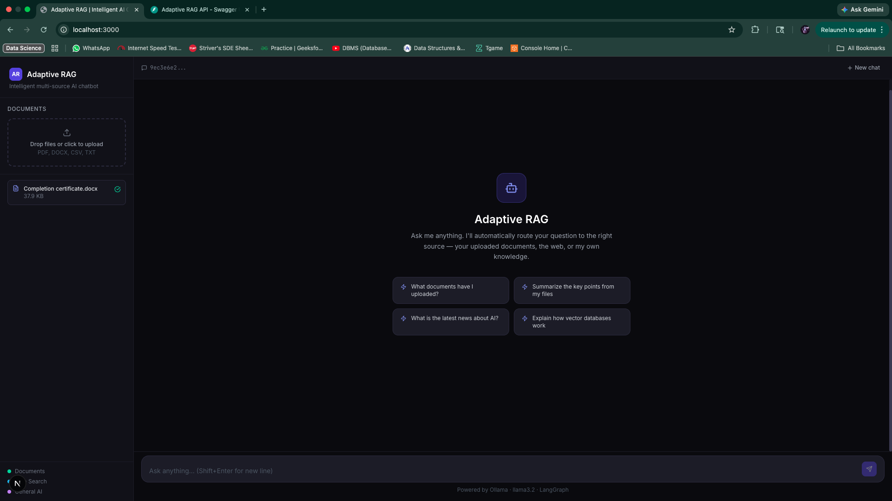
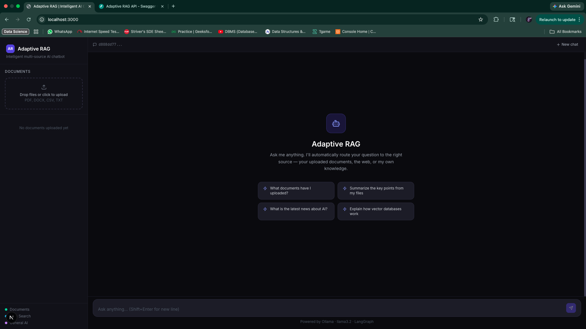
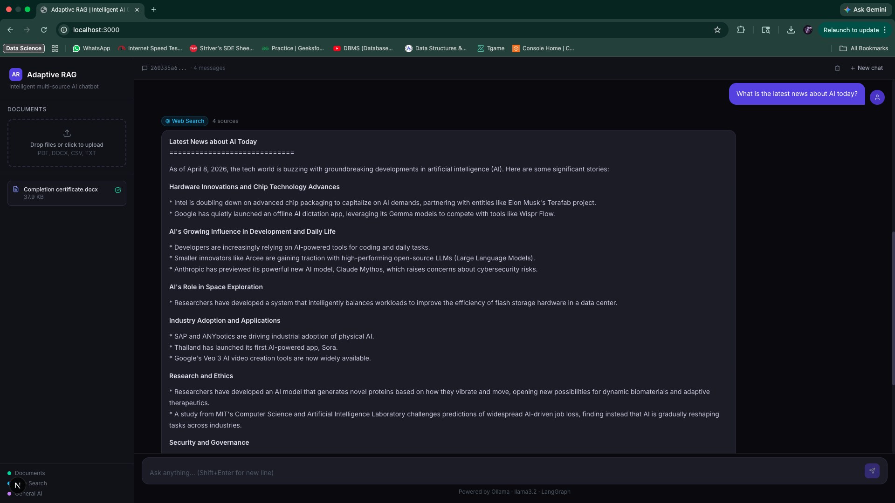
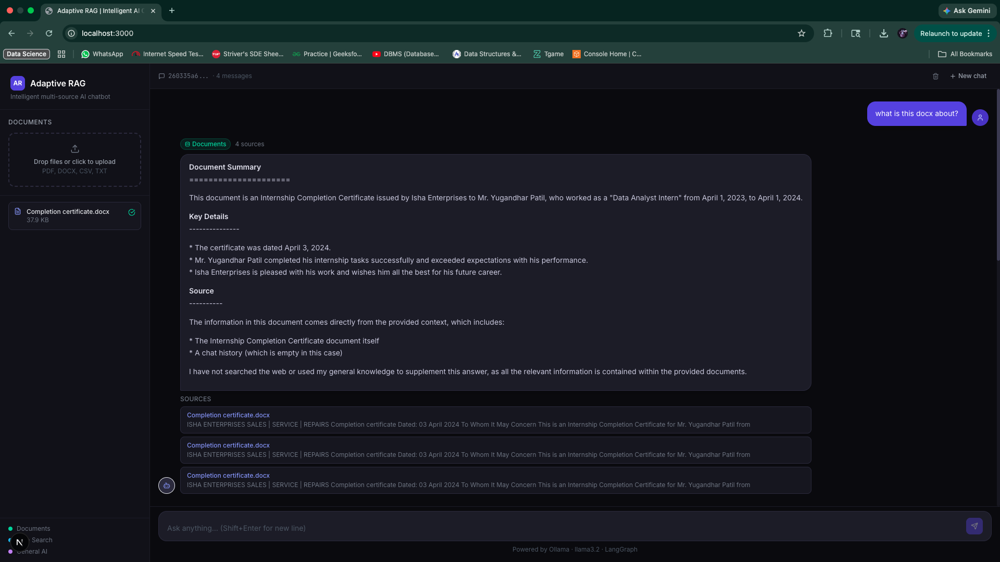
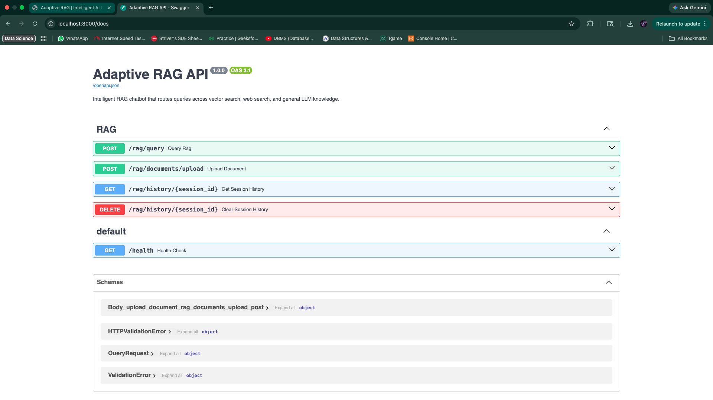

<div align="center">

# Adaptive RAG — Intelligent AI Chatbot

[](https://python.org)
[](https://fastapi.tiangolo.com)
[](https://nextjs.org)
[](https://langchain-ai.github.io/langgraph)
[](https://ollama.com)
[](LICENSE)

**An agentic RAG chatbot that intelligently routes every query to the right pipeline — documents, web search, or general LLM — powered entirely by a local model. No OpenAI. No API costs. 100% free.**

[Features](#features) • [Screenshots](#screenshots) • [Tech Stack](#tech-stack) • [Getting Started](#getting-started) • [API Reference](#api-reference) • [How Routing Works](#how-query-routing-works)

</div>

---

## Why This Project?

Most RAG demos hardcode a single retrieval path. Real questions don't work that way — some need your documents, some need live web data, and some just need a smart LLM response. This project uses a **LangGraph state machine** to decide the right path at runtime, giving you a chatbot that actually knows what to look for and where.

Everything runs locally with **Ollama llama3.2** — no OpenAI key, no usage fees, no data leaving your machine.

---

## Screenshots

<table>
  <tr>
    <td align="center"><strong>Main UI with Document Loaded</strong></td>
    <td align="center"><strong>Empty / Welcome State</strong></td>
  </tr>
  <tr>
    <td></td>
    <td></td>
  </tr>
  <tr>
    <td align="center"><strong>Document Query in Action</strong></td>
    <td align="center"><strong>Live Web Search Query</strong></td>
  </tr>
  <tr>
    <td></td>
    <td></td>
  </tr>
  <tr>
    <td align="center" colspan="2"><strong>Interactive API Docs (FastAPI / Swagger)</strong></td>
  </tr>
  <tr>
    <td colspan="2" align="center"></td>
  </tr>
</table>

---

## Features

- **Intelligent Query Routing** — LangGraph agent classifies each query and directs it to the optimal pipeline automatically
- **Document Upload & RAG** — Upload PDF, DOCX, CSV, or TXT files; chunks are embedded and stored in Qdrant for semantic retrieval
- **Live Web Search** — Falls back to Tavily web search for current events and real-time information
- **Local LLM via Ollama** — Runs llama3.2 entirely on your machine; zero API costs, full privacy
- **Persistent Chat History** — Conversations are stored in MongoDB and survive page refreshes
- **Agentic Architecture** — LangGraph state machine with conditional edges; not a simple chain
- **Modern React UI** — Next.js 14 frontend with Tailwind CSS, responsive design, and smooth UX
- **REST API** — Fully documented FastAPI backend with Swagger UI at `/docs`

---

## Tech Stack

| Layer | Technology | Purpose |
|---|---|---|
| **LLM** | Ollama llama3.2 | Local inference — no cloud required |
| **Agent Orchestration** | LangGraph | Stateful routing graph with conditional edges |
| **RAG Framework** | LangChain | Document loading, splitting, chain composition |
| **Backend API** | FastAPI | Async REST API with automatic OpenAPI docs |
| **Vector Store** | Qdrant | Semantic document retrieval |
| **Database** | MongoDB | Persistent chat history and session state |
| **Embeddings** | sentence-transformers | Local text embeddings (`all-MiniLM-L6-v2`) |
| **Web Search** | Tavily API | Real-time web search for live queries |
| **Frontend** | Next.js 14 | React SSR framework |
| **Styling** | Tailwind CSS | Utility-first responsive design |

---

## Project Structure

```
adaptive-rag-portfolio/
├── src/
│   ├── main.py                  # FastAPI app entry point
│   ├── api/
│   │   └── routes.py            # All API route handlers
│   ├── rag/
│   │   ├── graph_builder.py     # LangGraph state machine definition
│   │   ├── nodes.py             # Graph node functions (router, retriever, etc.)
│   │   ├── document_upload.py   # File parsing and chunking logic
│   │   └── retriever_setup.py   # Qdrant retriever configuration
│   ├── llms/                    # Ollama LLM initialization
│   ├── db/                      # MongoDB connection and helpers
│   ├── memory/                  # Chat history memory management
│   ├── tools/                   # Tavily web search tool wrapper
│   ├── models/                  # Pydantic request/response models
│   └── config/                  # Settings and environment config
├── frontend/
│   ├── src/
│   │   └── app/                 # Next.js App Router pages and components
│   ├── next.config.js
│   ├── tailwind.config.ts
│   └── package.json
├── screenshots/                 # UI screenshots for this README
├── requirements.txt
└── README.md
```

---

## Getting Started

### Prerequisites

- Python 3.11+
- Node.js 18+
- [Ollama](https://ollama.com/download) installed and running
- Docker (for MongoDB and Qdrant)
- [Tavily API key](https://tavily.com) (free tier available)

### 1. Clone the repository

```bash
git clone https://github.com/yugpatill/adaptive-rag-portfolio.git
cd adaptive-rag-portfolio
```

### 2. Start MongoDB and Qdrant with Docker

```bash
# MongoDB
docker run -d --name mongodb -p 27017:27017 mongo:7

# Qdrant
docker run -d --name qdrant -p 6333:6333 qdrant/qdrant
```

### 3. Pull the local LLM

```bash
ollama pull llama3.2
```

### 4. Set up the Python backend

```bash
python -m venv venv
source venv/bin/activate          # Windows: venv\Scripts\activate
pip install -r requirements.txt
```

### 5. Configure environment variables

Create a `.env` file in the project root:

```env
# Tavily (free tier at tavily.com)
TAVILY_API_KEY=your_tavily_api_key_here

# MongoDB
MONGODB_URI=mongodb://localhost:27017
MONGODB_DB_NAME=adaptive_rag

# Qdrant
QDRANT_HOST=localhost
QDRANT_PORT=6333

# Ollama
OLLAMA_BASE_URL=http://localhost:11434
OLLAMA_MODEL=llama3.2
```

### 6. Run the backend

```bash
uvicorn src.main:app --reload --port 8000
```

API is now live at `http://localhost:8000`
Swagger docs at `http://localhost:8000/docs`

### 7. Run the frontend

```bash
cd frontend
npm install
npm run dev
```

Open `http://localhost:3000` in your browser.

---

## API Reference

| Method | Endpoint | Description |
|--------|----------|-------------|
| `POST` | `/chat` | Send a message; returns streamed or full LLM response |
| `POST` | `/upload` | Upload a document (PDF, DOCX, CSV, TXT) for RAG |
| `GET` | `/history/{session_id}` | Retrieve full chat history for a session |
| `DELETE` | `/history/{session_id}` | Clear chat history for a session |
| `GET` | `/health` | Health check for the API and its dependencies |
| `GET` | `/docs` | Interactive Swagger UI |

---

## How Query Routing Works

Each incoming message passes through a LangGraph state machine with the following decision flow:

```
User Query
    │
    ▼
┌─────────────────────┐
│   Router Node        │  ← LLM classifies the query intent
│  (llama3.2)          │
└──────┬──────────────┘
       │
       ├─── "document" ──────► Qdrant Vector Search ──► Augmented LLM Response
       │
       ├─── "web_search" ────► Tavily Search API ───────► Augmented LLM Response
       │
       └─── "general" ───────► Direct LLM Response
```

**Routing logic:**
- **Document pipeline** — triggered when the query is likely answered by uploaded files (e.g., "summarize my report", "what does the contract say about...")
- **Web search pipeline** — triggered for current events, recent data, or anything time-sensitive (e.g., "latest news on...", "current price of...")
- **General LLM pipeline** — handles everything else: reasoning, coding, math, general knowledge

The router is a prompted LLM call, not a keyword matcher — it understands intent, not just surface patterns.

---

## License

This project is licensed under the [MIT License](LICENSE).

---

## Author

**Yugandhar Patil**

Built as a portfolio project to demonstrate agentic RAG architecture, local LLM integration, and full-stack AI application development.

---

<div align="center">

If this project was useful or interesting, consider giving it a star — it helps others find it.

**[⭐ Star this repo](https://github.com/yugpatill/adaptive-rag-portfolio)**

</div>
